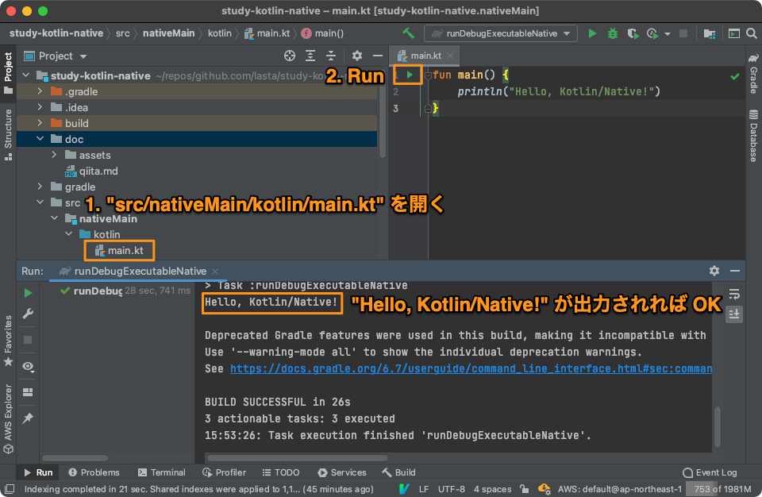

# Kotlin/Native on AWS Lambda その1 - 開発環境構築

## TL;DR
Kotlin/Native で書いたコードを Amazon Linux 2 上でビルド

## はじめに
こんにちは。 [lasta][github-lasta] です。

本記事は [Kotlin Advent Calendar 2020](https://qiita.com/advent-calendar/2020/kotlin) 8日目の記事です。
穴が空いていたので、後追いですが執筆しました。
昨日は [wrongwrong](https://qiita.com/wrongwrong) さんの [【Kotlin】KFunctionを高速に呼び出す（後編）](https://qiita.com/wrongwrong/items/fe75bae3911eff319e68) でした。

Kotlin 1.4 にて、 Kotlin/Native 含め Kotlin 及びその周辺に大幅なアップデートがありました。
詳細は公式ページ [What's New in Kotlin 1.4.0][kotlin-1.4] をご確認ください。

また、 [kotlinx.serialization 1.0 がリリースされた][kotlinx.serialization GA] (GA した) ことにより、 Kotlin/Native をプロダクション利用しやすくなりました。
これにより、 Kotlin で全プラットフォーム向けの実装ができるようになりましたね。

一方で Kotlin/Native はまだまだ発展途上にあります。
JetBrains 公式のサーバレスフレームワークとして [Kotless][Kotless] がありますが、 本記事執筆時点 (2020/12/12) では Kotlin-JVM しか対応していません。
GraalVM 向けはベータリリース段階であり、 Multiplatform 向け (JVM/JS/Native) は開発中です。

そのため、 AWS Lambda の [Custom Runtime][Custom Runtime] 上で Kotlin/Native を動かすことをゴールとして進めていきます。
本記事は3部編成の1部目になります。

* [Kotlin/Native on AWS Lambda その1 - 開発環境構築][study-faas-kotlin1] (本記事)
* [Kotlin/Native on AWS Lambda その2 - カスタムランタイム][study-faas-kotlin2] (執筆中)
* [Kotlin/Native on AWS Lambda その3 - 外部ライブラリ (Sentry) の導入][study-faas-kotlin3] (執筆中)

## 本記事のゴール
Kotlin/Native のコードを Amazon Linux 2 向けにネイティブビルドし、動作することを確認する

## 環境
[Kotlin][kotlinlang] は主に [JetBrains][jetbrains] 社が開発しているため、同じく [JetBrains][jetbrains] 社が開発している [IntelliJ IDEA][idea] を用いるととてもスムーズにローカルの環境構築を行う事ができます。

### 周辺環境
* MacBook Pro 2019
  * macOS Big Sur 11.0.1
* :wrench: IntelliJ IDEA Ultimate 2020.3
  * Community 版でもおそらく可能 ([機能比較](https://www.jetbrains.com/idea/features/editions_comparison_matrix.html))
* :wreanch: docker desktop 3.0.1
* Kotlin 1.4.20
  * [IntelliJ IDEA](https://plugins.jetbrains.com/plugin/6954-kotlin) および [Gradle](https://kotlinlang.org/docs/reference/using-gradle.html) が自動的に環境構築してくれるため、手動でのインストールは不要

## プロジェクト作成
IntelliJ IDEA を用いて作成します。
Gradle を利用するため、 `gradle init` で作成しても問題ありません。

スクリーンショットは IntelliJ IDEA Ultimate 2020.3 を用いて作成しております。

1. IntelliJ IDEA を起動
2. "File" → "New" → "Project"
3. "New Project" 
  1. "Kotlin" を選択
  2. "Name" を自由に指定
  3. "Location" を自由に指定
  4. "Multiplatform" の "Native Application" を指定
  5. "Build System" として "Gradle Kotlin" を指定
  6. "Project SDK" として Java 8 以降の JDK を指定
  7. "Group ID", "Artifact ID", "Version" を自由に指定
  8. "Next"
4. "New Project" 
  1. "Template" の "None" を指定
  2. "Finish"

いろいろなものが自動的に作成されます。

```
.
├── build.gradle.kts
├── gradle
│   └── wrapper
│       ├── gradle-wrapper.jar
│       └── gradle-wrapper.properties
├── gradle.properties
├── gradlew
├── gradlew.bat
├── settings.gradle.kts
└── src
    ├── nativeMain
    │   ├── kotlin
    │   │   └── main.kt
    │   └── resources
    └── nativeTest
        ├── kotlin
        └── resources
```

## サンプルコードの実行
まずは自動的に作成されるサンプルコードが動作することを確認します。

`src/nativeMain/kotlin/main.kt` を開き、 main 関数の左にある実行ボタンを押します。
初回ビルド時は native 向け依存ライブラリ (LLVM等) をダウンロードするため、少し時間がかかります。



## マルチプラットフォームビルド
[ローカルマシンのプラットフォームでビルドする][Hello Kotlin/Native using Gradle]ためにすべきことを確認するために、まずは `build.gradle.kts` を読み解いていきます。

### [基本設定](https://kotlinlang.org/docs/reference/mpp-discover-project.html#multiplatform-plugin)
```kotlin:build.gradle.kts
plugins {
    kotlin("multiplatform") version "1.4.20"
}

group = "me.lasta"
version = "1.0-SNAPSHOT"

repositories {
    mavenCentral()
}
```

Gralde プラグイン、アーティファクトのグループ名、バージョン、利用する外部ライブラリのリポジトリを指定しています。
ここまでは Kotlin/Native に限った話ではないため、割愛します。

### [ビルドターゲット](https://kotlinlang.org/docs/reference/mpp-discover-project.html#targets) の自動選択
```kotlin:build.gradle.kts
kotlin {
    val hostOs = System.getProperty("os.name")
    val isMingwX64 = hostOs.startsWith("Windows")
    val nativeTarget = when {
        hostOs == "Mac OS X" -> macosX64("native")
        hostOs == "Linux" -> linuxX64("native")
        isMingwX64 -> mingwX64("native")
        else -> throw GradleException("Host OS is not supported in Kotlin/Native.")
    }

    // 省略
}
```

`kotlin` 関数ブロックの前半では、まずビルドするプラットフォームを自動取得しています。
ホスト OS が Mac OS X であれば `macosX64` 用のバイナリが、 Linux であれば `linuxX64` 用のバイナリが生成されます。

Mac OS X 上で `macosX64` 用のバイナリと `linuxX64` 用のバイナリの両方を作成することも可能ですが、その場合はピュアな Kotlin およびマルチプラットフォーム対応している Kotlin ライブラリしか利用することができません。

次回以降でプラットフォーム依存のライブラリを利用する予定があるため、複数ターゲットビルドの解説は割愛します。

### [ソースセット](https://kotlinlang.org/docs/reference/mpp-discover-project.html#source-sets)
```kotlin:build.gradle.kts
kotlin {
    sourceSets {
        val nativeMain by getting
        val nativeTest by getting
    }
}
```

`src` 配下のどのディレクトリが `main` および `test` コードであるかを指定します。
Kotlin/Native 自体は複数プラットフォーム向けの実装を1プロジェクトで管理することができますが、今回は Amazon Linux 2 上で動作すれば十分であるため、デフォルトのままで問題ありません。

### [エントリポイント](https://kotlinlang.org/docs/reference/mpp-configure-compilations.html)
```kotlin:build.gradle.kts
kotlin {
    nativeTarget.apply {
        binaries {
            executable {
                entryPoint = "main"
            }
        }
    }
}
```

`entryPoint` には、エントリポイントとなる main 関数のパッケージと関数名を指定します。

パッケージを作成した場合は、下記のようになります。

```kotlin:src/nativeMain/kotlin/me/lasta/entrypoint/main.kt
package me.lasta.entrypoint

fun main() {
    println("Hello, Kotlin/Native! in me.lasta.entrypoint")
}
```

```kotlin:build.gradle.kts
kotlin {
    nativeTarget.apply {
        binaries {
            executable {
                // パッケージ + 関数名
                entryPoint = "me.lasta.entrypoint.main"
            }
        }
    }
}
```

なお、複数のバイナリを一度にビルドすることもできます。

このとき、生成されるバイナリを一意に定める必要があるため、 `executable` に引数に任意の値 (ここではパッケージ名) を指定する必要があります。

```kotlin:build.gradle.kts
kotlin {
    nativeTarget.apply {
        binaries {
            executable("root") {
                entryPoint = "main"
            }
            executable("me.lasta.entrypoint") {
                // パッケージ + 関数名
                entryPoint = "me.lasta.entrypoint.main"
            }
        }
    }
}
```

この状態で `./gradlew build` を実行すると、下記ようにバイナリが生成されます。

```console
$ find build -name '*.kexe' | grep -v 'dSYM'
build/bin/native/rootDebugExecutable/root.kexe
build/bin/native/me.lasta.entrypointDebugExecutable/me.lasta.entrypoint.kexe
build/bin/native/rootReleaseExecutable/root.kexe
build/bin/native/me.lasta.entrypointReleaseExecutable/me.lasta.entrypoint.kexe
```

すべて実行可能ファイルです。

```console
for kexe in $(find build -name '*.kexe' | grep -v 'dSYM'); do echo "Run: ${kexe}"; "./${kexe}"; done
Run: build/bin/native/rootDebugExecutable/root.kexe
Hello, Kotlin/Native!
Run: build/bin/native/me.lasta.entrypointDebugExecutable/me.lasta.entrypoint.kexe
Hello, Kotlin/Native! in me.lasta.entrypoint
Run: build/bin/native/rootReleaseExecutable/root.kexe
Hello, Kotlin/Native!
Run: build/bin/native/me.lasta.entrypointReleaseExecutable/me.lasta.entrypoint.kexe
Hello, Kotlin/Native! in me.lasta.entrypoint
```

## Amazon Linux 2 上で Hello, Kotlin/Native!
Amazon Linux 2 上で動作させる準備を進めていきます。

### ビルド環境の準備


## おわりに
明日は [fisherman08](https://qiita.com/fisherman08) さんの [KotlinのSealed Classは良いよ、という話](https://qiita.com/fisherman08/items/0eb01ed2da6d543be4b0) です。

[github-lasta]: https://github.com/lasta
[Kotless]: https://github.com/JetBrains/kotless
[Custom Runtime]: https://docs.aws.amazon.com/ja_jp/lambda/latest/dg/runtimes-custom.html
[study-faas-kotlin1]: https://qiita.com/lasta/items/9169727d89829cf007c3
[study-faas-kotlin2]: https://qiita.com/lasta/items/7f576fce42d753db21fb
[study-faas-kotlin3]: https://qiita.com/lasta/items/237acde9aa54f2668717
[Hello Kotlin/Native using Gradle]: https://kotlinlang.org/docs/tutorials/native/using-gradle.html
